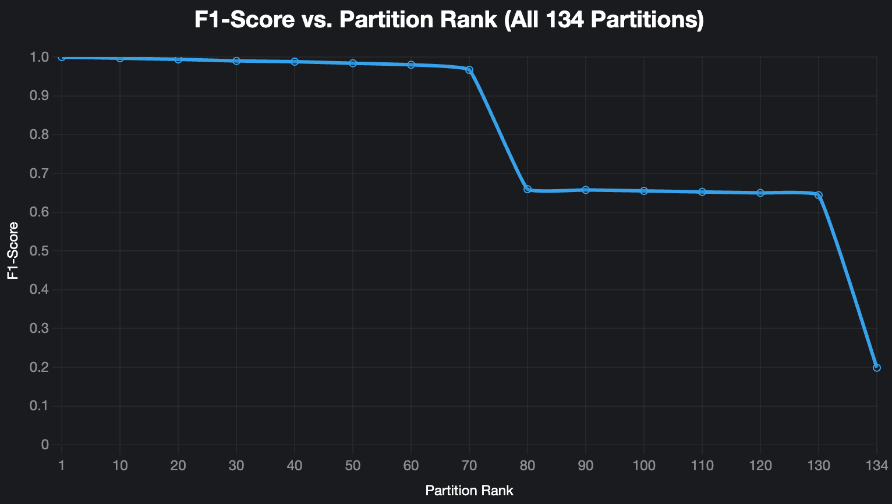
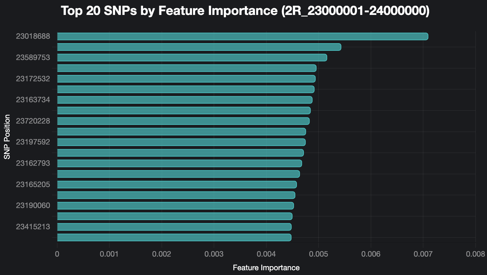

# Google Summer of Code 2025 Final Report: Anopheles Mosquito Genomic Taxon Classifier

- **Contributor:** Deepak Silaych
- **Organisation:** MalariaGEN
- **Mentors:** Anastasia Hernandez-Koutoucheva, Chris Clarkson, Jon Brenas
- **Project Repository:** [malariagen/vector-taxon-classifier-prediction](https://github.com/malariagen/vector-taxon-classifier-prediction)
- **Contact:** `deepaksilaych@gmail.com` / [GitHub Profile](https://github.com/deepaksilaych)

---

### Abstract

Accurate identification of _Anopheles_ mosquito species is critical for effective malaria vector control, yet many species are morphologically indistinguishable. This project addressed this challenge by developing a robust machine learning toolkit to classify mosquito species using whole-genome sequence data from the MalariaGEN Vector Observatory. The core of the project involved creating a scalable pipeline to train and evaluate classifiers on discrete genomic partitions, a "divide and conquer" strategy essential for handling terabyte-scale data. After comparing multiple models, a Random Forest-based approach was selected and refined, achieving high accuracy in validation tests. The final deliverable is a user-friendly Python library with a full-featured Command-Line Interface (CLI), designed for broad accessibility to support more precise and impactful malaria control strategies.

---

### 1. Motivation & Overview

In the fight against malaria, knowing your enemy is everything. The primary mosquito vectors in Africa belong to a species complex where members look identical but behave differently, impacting disease transmission and control efforts. Misidentification leads to wasted resources and ineffective interventions. This project targeted this gap by building a computational tool to reliably differentiate these cryptic species using their unique genomic "fingerprints." The goal was to harness MalariaGEN's vast genomic dataset to create an automated, accurate, and accessible species identification tool for the public health community. This work matters because precise species identification is a foundational step for targeted, effective malaria control.

---

### 2. Technical Contributions

My work wasn't just about training a model; it was about building an end-to-end system to solve three core problems in genomic classification: handling massive data, training robust models, and making reliable predictions. 💻

#### 1. Scalable Data Pipeline for Terabyte-Scale Genomes

- **Challenge:** The primary obstacle was the sheer scale of the MalariaGEN dataset. With terabytes of data and tens of millions of SNPs per sample, loading the entire genome into memory for processing is impossible on standard hardware. Furthermore, raw genotype data (e.g., `[0, 1]` for a heterozygote) must be converted into a numerical format (0, 1, or 2) for machine learning, and a simple `for` loop to do this would be disastrously slow.

- **Solution:** I designed a pipeline that processes data without ever loading the entire dataset.
  - **Partitioned Access:** The solution's foundation is leveraging the **Zarr** data format. Instead of reading the whole genome, my pipeline reads small, independent 1-million-base-pair chunks, or **"partitions."** This keeps the memory footprint incredibly low at all times.
  - **Vectorized Encoding:** To solve the slow conversion problem, I wrote a custom **NumPy vectorization** function. This function transforms entire arrays of genotype data into numerical features at once, using highly optimized C code under the hood. This single step provided a massive performance boost, making the feature engineering process practical.
  - **Intelligent Imputation:** Genomic data is often messy, with missing values. I trained a separate `SimpleImputer` for _each partition_. This is a crucial detail, as it fills missing SNPs based on the local genetic context of that specific region, which is more biologically accurate than using a single global imputer.

#### 2. Partition-Based Framework for Model Training

- **Challenge:** Training a single model on millions of SNP features is computationally infeasible and a recipe for overfitting. Furthermore, evaluating hundreds of potential models is difficult, especially since the dataset has a significant **class imbalance** (some species are much rarer than others), which can lead to misleading accuracy scores.

- **Solution:** I implemented a "divide and conquer" strategy by building a framework to train and evaluate hundreds of specialized models.
  - **Automated Training Loop:** The framework systematically iterates through each genomic partition, using the data pipeline to extract features and train a dedicated **Random Forest** model for each one. All assets—the model, imputer, and feature list—are saved in a structured directory system.
  - **Robust Validation:** To counter class imbalance, I used **Stratified K-Fold Cross-Validation**. This ensures that every validation split contains the same ratio of species as the original dataset. This step was critical for generating reliable performance metrics (like the F1-score) that truly reflect the model's ability to identify both common and rare species. All results were logged to structured `.json` files for later analysis.

#### 3. Robust Ensemble Prediction Engine

- **Challenge:** The training framework produced hundreds of "specialist" models, but a user needs a single, definitive answer. Not all genomic regions are equally predictive, and some may have poor-quality data for a given sample. The final challenge was to intelligently combine the outputs of these specialists into one highly reliable prediction.

- **Solution:** The final classifier is an **ensemble** that aggregates votes from the best-performing models.
  - **Data-Driven Model Ranking:** I first analyzed the validation results from all ~200 trained models to create a data-driven leaderboard, ranking each genomic partition by its F1-score. This allowed me to identify which parts of the genome were most predictive of species identity.
  - **Top-50 Majority Vote:** For predictions, the engine uses only the **top 50** models from this leaderboard. It gets a "vote" from each, and the final classification is determined by a **majority vote**. This approach is incredibly robust; if a few models fail or give weak predictions due to noise, the strong consensus from the other high-performing models ensures the final answer is still accurate and reliable.

---

### 3. Model Prototyping and Selection

Before committing to the final architecture, I needed to validate two key hypotheses: 1) Is the "divide and conquer" partition strategy effective? and 2) Are the individual models learning meaningful biological signals?

To test the first hypothesis, I trained a classifier on **all 162 available genomic partitions** and ranked them by their F1-score. I then plotted the cumulative performance of an ensemble as more, lower-ranked partitions were included. The result was a clear confirmation of the strategy's validity.



**Image 2:** **Caption:** This plot shows the F1-score of the ensemble as partitions are added, from highest-ranked to lowest. The performance is nearly perfect for the top 50-60 partitions but then begins to decline as less-informative partitions add noise. This provides a strong, data-driven justification for using a **"Top-N" ensemble strategy**, as it maximizes accuracy by excluding the long tail of low-performing partitions.

---

To validate the second hypothesis, I looked inside one of the top-performing models (from partition `2R_23000001-24000000`) to see what it was learning. By extracting the **feature importances**, I could confirm that the model was identifying specific, highly influential SNPs to make its decisions, rather than just learning noise.



**Image 1:** **Caption:** A feature importance plot from a single high-performing partition. The model has clearly assigned high importance to a small number of specific SNP positions, demonstrating that it is learning real, localized biological signals to differentiate between species.

---

**Conclusion and Key Learning:**
This exploratory phase proved that the partitioned ensemble strategy was highly effective. My key learning was that **ranking and selecting the top partitions is crucial for success**. The analysis also gave me confidence that the individual Random Forest models were not just "black boxes" but were successfully pinpointing key genetic markers.

---

### 4. Milestones & Methods

| Milestone                      | Short description                                                              | Status | Link                                                                                                                                    |
| :----------------------------- | :----------------------------------------------------------------------------- | :----- | :-------------------------------------------------------------------------------------------------------------------------------------- |
| **Initial Data Exploration**   | Analyzed training data from the MalariaGEN API, identified class imbalance.    | Done   | [1_EDA_Training_Data.ipynb](https://github.com/malariagen/vector-taxon-classifier/blob/master/1_EDA_Training_Data.ipynb) |
| **Model Prototyping**          | Compared several models and selected Random Forest for its robust performance. | Done   | [5_xgboost_train.ipynb](https://github.com/malariagen/vector-taxon-classifier/blob/master/5_xgboost_train.ipynb)                           |
| **Ensemble Training Pipeline** | Developed the script to partition the genome and train a model for each chunk. | Done   | [6_RF_train.ipynb](https://github.com/malariagen/vector-taxon-classifier/blob/master/6_RF_train.ipynb)                       |
| **Validation & Analysis**      | Aggregated cross-validation scores to rank partitions and select the top 50.   | Done   | [7_evalutaion.ipynb](https://github.com/malariagen/vector-taxon-classifier/blob/master/7_evalutaion.ipynb)             |
| **CLI & API Development**      | Packaged the core logic into a Python library with a command-line interface.   | Done   | [main.py](https://github.com/malariagen/vector-taxon-classifier-prediction/blob/master/src/main.py)                                                  |
| **Documentation & Tutorials**  | Wrote user guides and five Jupyter notebooks demonstrating usage.              | Done   | [notebooks/](https://github.com/malariagen/vector-taxon-classifier-prediction)                                            |

---

### 5. Results & Key Findings

- **High-Accuracy Partitions Identified:** Through the validation framework, **I identified** the most predictive regions of the genome. The top 50 partitions achieved mean cross-validation accuracies ranging from a high of **99.98%** down to **98.47%**, demonstrating that my partitioned approach was highly effective.

- **Robust Ensemble Prediction:** The ensemble classifier **I built**, using a majority vote from these top 50 partitions, correctly classified test samples. For example, in my tests ([11_zarr_test.ipynb](https://github.com/malariagen/vector-taxon-classifier/blob/master/11_zarr_test.ipynb)), it correctly predicted sample `AR0047-C` as `coluzzii` by leveraging the strong consensus from these high-performing models.

- **Usable Deliverables:** **I delivered** a fully packaged Python library on GitHub ([malariagen-vector-taxon-classifier](https://github.com/malariagen/vector-taxon-classifier-prediction)), which includes the pre-trained models, a [CLI](https://github.com/malariagen/vector-taxon-classifier-prediction/tree/master/src/cli.py), and a programmatic [API](https://github.com/malariagen/vector-taxon-classifier-prediction/tree/master/src/main.py) for easy use by the research community.

- **Comprehensive Tutorials:** To ensure the tool is accessible, **I developed** a suite of five Jupyter notebooks ([01_basic_setup.ipynb](https://github.com/malariagen/vector-taxon-classifier-prediction/tree/master/notebooks/01_basic_setup.ipynb) to [05_CLI_and_Utilities.ipynb](https://github.com/malariagen/vector-taxon-classifier-prediction/tree/master/notebooks/05_CLI_and_Utilities.ipynb)) that provide users with a step-by-step guide for installation, data loading, and prediction.

My key takeaway is that the partitioned ensemble approach is a highly effective strategy for genomic classification. It successfully breaks down a massive computational problem into manageable parts and leverages the most informative regions of the genome to deliver highly accurate and reliable results.

---

### 6. Reflections & What I Learned

This GSoC project was a deep dive into the practical challenges of applying machine learning to massive scientific datasets. My biggest technical lesson was the importance of a modular, iterative workflow. I started by focusing on finding the "perfect" model, but quickly realized that the real breakthrough came from architecting a robust pipeline for data processing and partitioning first. This framework allowed me to experiment with different models, analyze results ([7_evalutaion.ipynb](https://github.com/malariagen/vector-taxon-classifier/blob/master/7_evalutaion.ipynb)), and systematically build a better solution.

The biggest challenge I faced was managing the sheer scale of the data and the long training times. A single run to train models for all partitions could take hours. I tackled this by writing scripts that could be stopped and resumed, logging progress meticulously, and parallelizing tasks where possible. My proudest moment was seeing the final packaged tool—with its clean [CLI](https://github.com/malariagen/vector-taxon-classifier-prediction/tree/master/src/cli.py) and tutorial notebooks—come together. It transformed a collection of experimental scripts into a polished, professional tool that others could easily use, which felt like the true culmination of my work.

---

### 7. Future Work

This project provides a strong foundation for genomic species classification. The following are concrete next steps, prioritized to deliver the most value.

- **Automate Model Retraining (High Priority):**

  - **Why it matters:** The MalariaGEN Vector Observatory is continuously updated. The tool needs a clear, automated workflow for retraining all partition models on new genomic data releases to maintain accuracy.
  - **Complexity:** Medium. Involves scripting the existing training pipeline ([6_RF_train.ipynb](https://github.com/malariagen/vector-taxon-classifier/blob/master/6_RF_train.ipynb)) to run as a single, robust command.

- **Incorporate Additional Species (Medium Priority):**
  - **Why it matters:** The current models are trained on the _An. gambiae_ complex. Expanding the tool to classify species from other complexes (e.g., _An. funestus_) would greatly increase its impact.
  - **Complexity:** Medium. Requires curating new training data but the existing training and prediction pipelines are directly reusable.

---

### 8. Suggestions for Future GSoC Contributors

Based on my experience this summer, I would offer the following advice to future GSoC contributors working with MalariaGEN or on similar large-scale bioinformatics projects:

- **Embrace the Pivot:** My initial proposal mentioned several advanced models, but early exploration showed that a well-tuned Random Forest on partitioned data was highly effective. Don't be afraid to let your experimental results guide you, even if it means deviating from your original plan. The goal is to solve the problem, not to rigidly follow a proposal.

- **Communication is Your Best Tool:** Regular, transparent communication with your mentors is crucial. My weekly check-ins were invaluable for getting feedback, overcoming roadblocks, and staying aligned with the project's goals. Don't wait until you're stuck; share your progress, your messy notebooks, and your questions.

- **Document As You Go:** The Jupyter notebooks I created during my exploration ([notebooks/](https://github.com/malariagen/vector-taxon-classifier-prediction) directory) were messy but became an invaluable log of my work. They made it much easier to write this final report and later create the clean, user-facing tutorial notebooks. Write down your thought process—it will save you a massive amount of effort later.

- **Think About Your End User:** The decision to build both a programmatic API ([main.py](https://github.com/malariagen/vector-taxon-classifier-prediction/tree/master/src/main.py)) and a simple CLI ([cli.py](https://github.com/malariagen/vector-taxon-classifier-prediction/tree/master/src/cli.py)) was driven by considering the different needs of potential users. Always ask: "Who will use this tool, and how can I make their life easier?" This perspective transforms a good technical project into a great, impactful one.

---

### 9. How to Reproduce / Where to Find the Code

All code, models, and documentation are publicly available in the project repository.

- **Repository URL:** [https://github.com/malariagen/vector-taxon-classifier-prediction](https://github.com/malariagen/vector-taxon-classifier-prediction)
- **Training Branch:** [`notebooks`](https://github.com/malariagen/vector-taxon-classifier-prediction/tree/master/notebooks)

- **Tutorial Notebooks:** The best way to get started is to run the tutorial notebooks located in the `notebooks/` directory in the final repository. Start with `01_basic_setup.ipynb`.

- **Minimal Example (CLI):**
  To reproduce a key result, first install the package, then run a prediction using the CLI on a sample Zarr file URL:

  ```bash
  # Install the package from GitHub
  pip install git+https://github.com/malariagen/vector-taxon-classifier.git@prod

  # Run prediction on a sample from Ag3.0 data release
  # (Note: This is a conceptual example; the CLI expects a local file path)
  # First download a file, then run:
  python src/cli.py predict /path/to/your/AR0047-C.gatk.zarr.zip --top-n-classifiers 50
  ```
